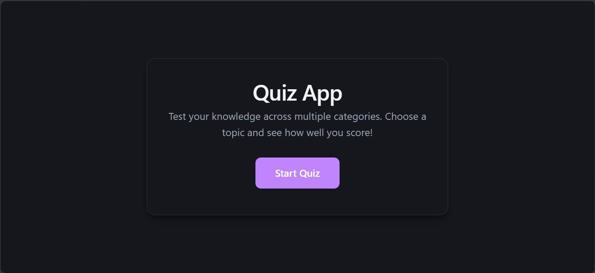
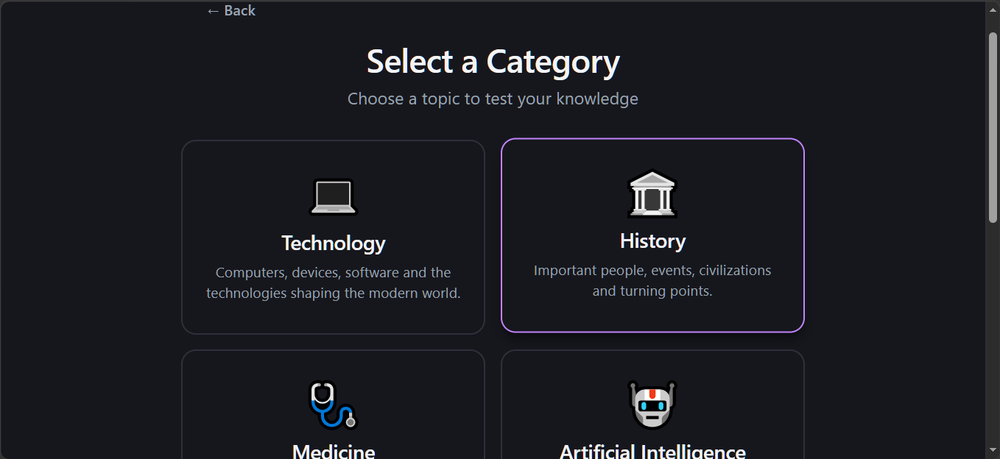
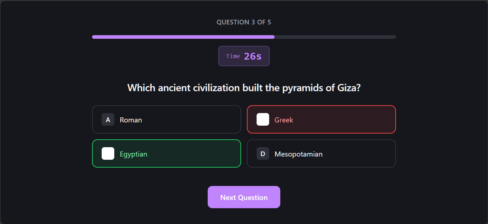
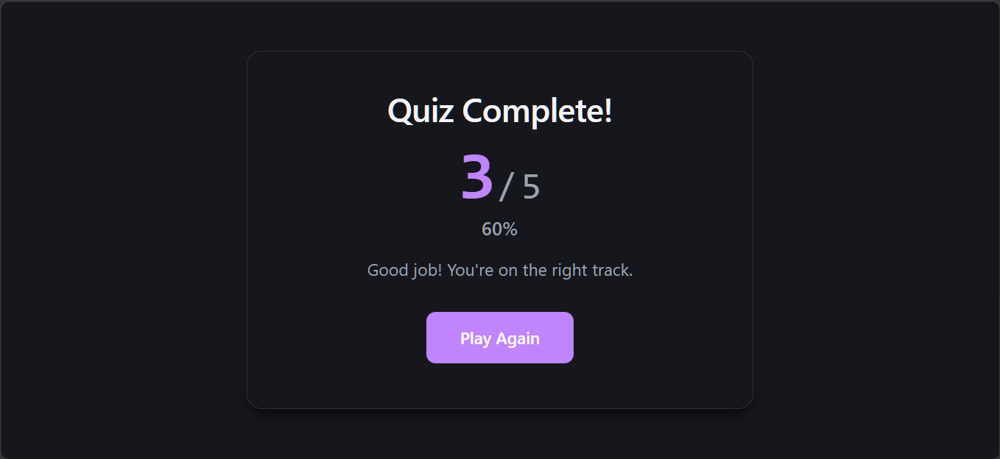

# Quiz App

A modern web-based quiz application built with React, TypeScript, and Vite.

The application lets users choose a quiz category, answer timed questions, receive immediate feedback, and view their final score. Each session generates a randomized set of questions while tracking previously used questions to improve variety across sessions.

## Features

- Category-based quizzes
- Randomized question sessions
- 5 questions per session
- 30-second timer per question
- Immediate answer feedback
- Automatic scoring
- Progress tracking
- Results screen
- Play-again flow
- Question history stored locally
- Responsive interface
- Type-safe React + TypeScript implementation

## Preview

### Welcome



### Categories



### Quiz



### Results



## Quiz Flow

```text
Welcome
   ↓
Choose Category
   ↓
Timed Quiz
   ↓
Answer Feedback
   ↓
Results
   ↓
Play Again

## CATEGORIES


The application currently includes multiple knowledge categories, including:

Technology
History
Medicine
Artificial Intelligence
Machine Learning
Programming Languages

Additional categories can be added through the quiz data configuration.

Tech Stack
React
TypeScript
Vite
CSS
ESLint

## Project Structure

quiz-app/
├── public/
│   ├── favicon.svg
│   └── icons.svg
│
├── src/
│   ├── assets/
│   │   └── hero.png
│   ├── components/
│   │   ├── CategoriesScreen.tsx
│   │   ├── QuizScreen.tsx
│   │   ├── ResultsScreen.tsx
│   │   └── WelcomeScreen.tsx
│   ├── utils/
│   │   └── quiz.ts
│   ├── App.css
│   ├── App.tsx
│   ├── data.ts
│   ├── index.css
│   ├── main.tsx
│   ├── session.ts
│   └── types.ts
│
├── index.html
├── package.json
├── tsconfig.json
├── tsconfig.node.json
├── vite.config.ts
└── eslint.config.js

Getting Started
Requirements
Node.js
npm
Installation

Clone the repository and enter the application directory:

git clone https://github.com/bakeolam-beep/quiz-app.git
cd quiz-app/quiz-app

Install dependencies:

npm install
Development

Start the local development server:

npm run dev

Vite will provide a local URL in the terminal.

Production Build

Create a production build:

npm run build
Preview Production Build
npm run preview
Lint
npm run lint
How It Works

When a user selects a category, the application creates a quiz session using the available questions for that category.

Questions are shuffled before a session is created. The application also maintains question history in browser local storage so previously used questions can be avoided when enough unused questions are available.

Each question has a 30-second time limit. Selecting an answer immediately evaluates the response and stops the timer. When the timer reaches zero, the question is automatically submitted.

After completing the session, the user receives a results summary showing their score and can start another quiz.

Local Storage

The application uses browser local storage to maintain question history between sessions.

The stored history is used to improve question variety across subsequent quiz sessions on the same browser.

Clearing browser storage will reset the stored question history.

Development

This project was built as a practical React and TypeScript application focused on:

Component-based UI architecture
React state management
Timed interactions
Data-driven rendering
Randomized session generation
Local persistence
Type-safe application logic
Responsive frontend development
Status

Completed

The application has a functional quiz flow and production build configuration.

License

This project is available for portfolio and educational purposes.


### One important correction

I deliberately **did not put a fake live-demo URL, fake screenshots, fake author information, or claims about technologies the app doesn't use**.

Also, the README's clone command reflects the current GitHub structure:

```bash
cd quiz-app/quiz-app

because the Vite application is nested inside the repository.